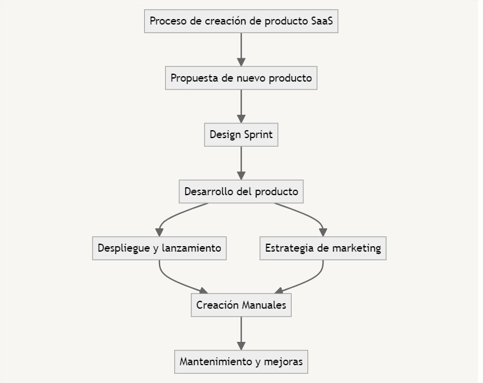

## Proceso de creación de productos SaaS

## Objetivo:
Desarrollar y lanzar productos SaaS innovadores y de alta calidad que satisfagan las necesidades del mercado y de los clientes, asegurando un ciclo de vida del producto eficiente y sostenible.

## Alcance:
Desde la propuesta inicial del nuevo producto hasta su despliegue, lanzamiento, creación de manuales, y mantenimiento continuo.

## Responsables:
CSO
CEO
Equipo de Desarrollo
CMO
## Diagrama Proceso
```mermaid
graph TD
    A[Proceso de creación de producto SaaS] --> B[Propuesta de nuevo producto]
    B --> C[Design Sprint]
    C --> D[Desarrollo del producto]
    D --> E[Despliegue y lanzamiento]
    D --> F[Estrategia de marketing]
    E --> G[Creación de Manuales]
    F --> G[Creación de Manuales]
    G --> H[Mantenimiento y mejoras]
```

## Descripción de las Actividades:
Propuesta de Nuevo Producto:

Descripción: Generar ideas para nuevos productos SaaS basadas en estudios de mercado, feedback de clientes y tendencias tecnológicas.
Responsable: Equipo de Innovación.
Entrada: Ideas y análisis de mercado.
Salida: Propuesta formal de nuevo producto.
Design Sprint:

Descripción: Realizar un ciclo de design sprint para definir y prototipar rápidamente las funcionalidades clave del nuevo producto.
Responsable: Equipo de Innovación y Desarrollo.
Entrada: Propuesta de nuevo producto.
Salida: Prototipo y validación inicial.
Desarrollo del Producto:

Descripción: Desarrollar el producto SaaS siguiendo metodologías ágiles, incluyendo desarrollo, pruebas y refinamiento.
Responsable: Equipo de Desarrollo.
Entrada: Prototipo validado.
Salida: Producto desarrollado.
Despliegue y Lanzamiento:

Descripción: Implementar y lanzar el producto en el entorno de producción, asegurando que todos los sistemas y servicios estén correctamente configurados.
Responsable: Equipo de Desarrollo y Operaciones.
Entrada: Producto desarrollado.
Salida: Producto en producción.
Estrategia de Marketing:

Descripción: Desarrollar e implementar una estrategia de marketing para el lanzamiento del nuevo producto, incluyendo campañas de promoción y materiales de marketing.
Responsable: Equipo de Marketing.
Entrada: Producto listo para lanzamiento.
Salida: Campaña de marketing lanzada.
Creación de Manuales:

Descripción: Elaborar manuales y documentación técnica para usuarios y administradores del nuevo producto.
Responsable: Equipo de Documentación.
Entrada: Producto desarrollado y estrategia de marketing.
Salida: Manuales y documentación completa.
Mantenimiento y Mejoras:

Descripción: Realizar el mantenimiento continuo del producto, incluyendo actualizaciones, mejoras y soporte a los usuarios.
Responsable: Equipo de Soporte y Mantenimiento.
Entrada: Producto en producción y manuales creados.
Salida: Producto mantenido y mejorado.
Indicadores de Desempeño:
Tiempo de Desarrollo:

Descripción: Medir el tiempo total desde la propuesta del producto hasta su lanzamiento.
Meta: Completar el ciclo de desarrollo en menos de 6 meses.
Calidad del Producto:

Descripción: Evaluar la cantidad de errores y problemas encontrados post-lanzamiento.
Meta: Menos del 5% de errores críticos reportados en los primeros 3 meses.
Satisfacción del Cliente:

Descripción: Realizar encuestas de satisfacción a los clientes después del lanzamiento.
Meta: 85% de clientes satisfechos o muy satisfechos con el nuevo producto.
Adopción del Producto:

Descripción: Medir el número de nuevos usuarios y empresas que adoptan el producto en los primeros 6 meses.
Meta: Alcanzar 500 nuevos usuarios en los primeros 6 meses.
Registro y Documentación:
Registrar todas las etapas del proceso de creación del producto en un sistema de gestión de proyectos, documentando las decisiones clave, hitos y resultados de cada fase para futuras referencias y auditorías de calidad.