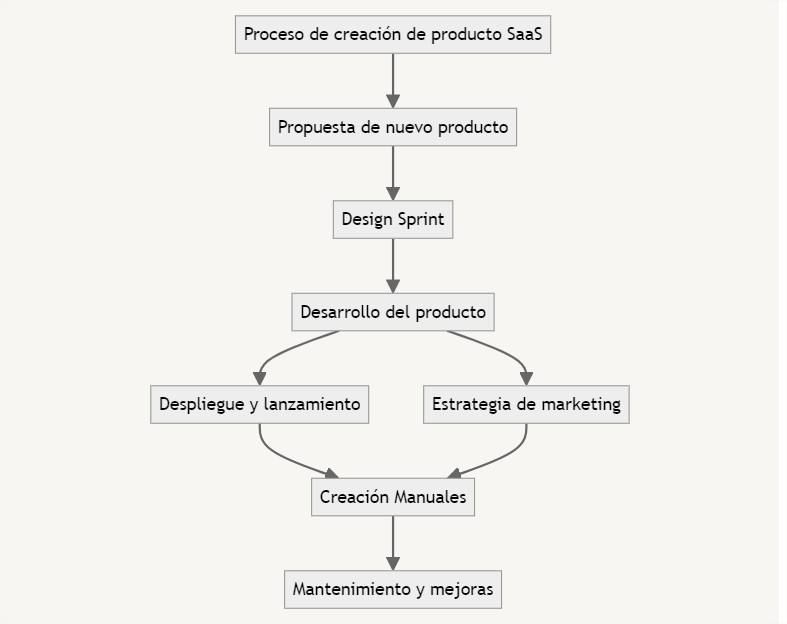

## Proceso de creación de productos SaaS

## Objetivo:
Desarrollar y lanzar productos SaaS innovadores y de alta calidad que satisfagan las necesidades del mercado y de los clientes, asegurando un ciclo de vida del producto eficiente y sostenible.

## Alcance:
Desde la propuesta inicial del nuevo producto hasta su despliegue, lanzamiento, creación de manuales, y mantenimiento continuo.

## Responsables:
CSO
CEO
Equipo de Desarrollo
CMO
## Diagrama Proceso

## Descripción de las Actividades:

- Propuesta de Nuevo Producto:

    -  Descripción: Generar ideas para nuevos productos SaaS basadas en estudios de mercado, feedback de clientes y tendencias tecnológicas.
    - Responsable: Equipo de Innovación.
    - Entrada: Ideas y análisis de mercado.
    - Salida: Propuesta formal de nuevo producto.
- Design Sprint:

    - Descripción: Realizar un ciclo de design sprint para definir y prototipar rápidamente las funcionalidades clave del nuevo producto.
    - Responsable: Equipo de Innovación y Desarrollo.
    - Entrada: Propuesta de nuevo producto.
    - Salida: Prototipo y validación inicial.

- Desarrollo del Producto:
    - Descripción: Desarrollar el producto SaaS siguiendo metodologías ágiles, incluyendo desarrollo, pruebas y refinamiento.
    - Responsable: Equipo de Desarrollo.
    - Entrada: Prototipo validado.
    - Salida: Producto desarrollado.
- Despliegue y Lanzamiento:
    - Descripción: Implementar y lanzar el producto en el entorno de producción, asegurando que todos los sistemas y servicios estén correctamente configurados.
    -  Responsable: Equipo de Desarrollo y Operaciones.
    - Entrada: Producto desarrollado.
    - Salida: Producto en producción.

- Estrategia de Marketing:
    - Descripción: Desarrollar e implementar una estrategia de marketing para el lanzamiento del nuevo producto, incluyendo campañas de promoción y materiales de marketing.
    - Responsable: Equipo de Marketing.
    - Entrada: Producto listo para lanzamiento.
    - Salida: Campaña de marketing lanzada.

- Creación de Manuales:
    - Descripción: Elaborar manuales y documentación técnica para usuarios y administradores del nuevo producto.
    - Responsable: Equipo de Documentación.
    - Entrada: Producto desarrollado y estrategia de marketing.
    - Salida: Manuales y documentación completa.

- Mantenimiento y Mejoras:
    - Descripción: Realizar el mantenimiento continuo del producto, incluyendo actualizaciones, mejoras y soporte a los usuarios.
    - Responsable: Equipo de Soporte y Mantenimiento.
    - Entrada: Producto en producción y manuales creados.
    - Salida: Producto mantenido y mejorado.

## Indicadores de Desempeño:

- Tiempo de Desarrollo:
    - Descripción: Medir el tiempo total desde la propuesta del producto hasta su lanzamiento.
    - Meta: Completar el ciclo de desarrollo en menos de 6 meses.

- Calidad del Producto:
    - Descripción: Evaluar la cantidad de errores y problemas encontrados post-lanzamiento.
    - Meta: Menos del 5% de errores críticos reportados en los primeros 3 meses.

- Satisfacción del Cliente:
- Descripción: Realizar encuestas de satisfacción a los clientes después del lanzamiento.
- Meta: 85% de clientes satisfechos o muy satisfechos con el nuevo producto.

- Adopción del Producto:
- Descripción: Medir el número de nuevos usuarios y empresas que adoptan el producto en los primeros 6 meses.
- Meta: Alcanzar 500 nuevos usuarios en los primeros 6 meses.

-  Registro y Documentación:
- Registrar todas las etapas del proceso de creación del producto en un sistema de gestión de proyectos, documentando las decisiones clave, hitos y resultados de cada fase para futuras referencias y auditorías de calidad.